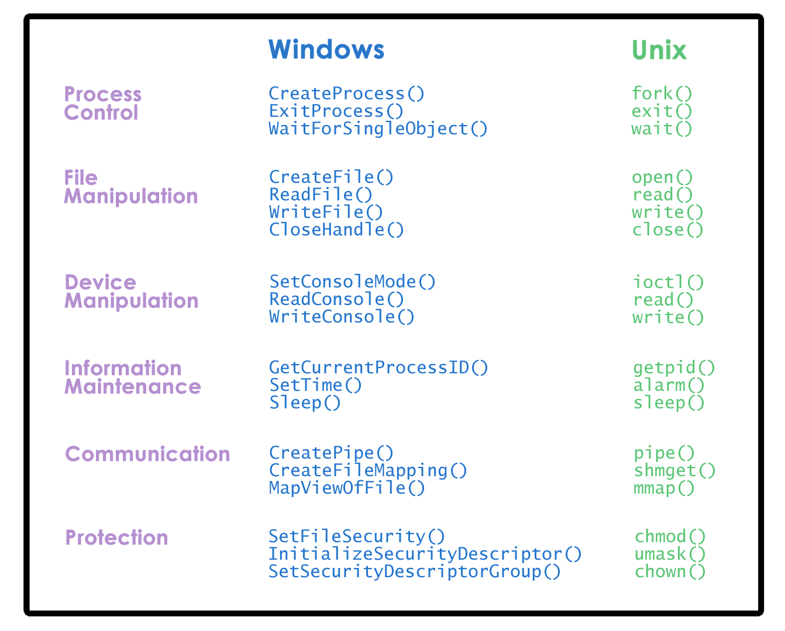

#LESSON 2
## Course topics
- OS abstraction, mechanisms and policies for
- processes and process management
- threads and concurrency
- resource management: scheduling, memory managment
- OS services for communication and I/O
- OS support for distributed services
- system software for data center and cloud environment

## Theory and practice
### Sequence of Programming Projects
- Threads, concurrency, and synchronization
- single-node OS mechanisms
    - inter-process communication, scheduling
- multi-node OS mechanisms
    - remote procedure calls(RPC), ...
- experimental design and evaluation
- programming in C in Linux

#LESSON 3
## What is operating system?
- hide hardware complexity
- resource managment
- provide isolation and protection

## arbitration
- distributing memory between multiple processes
## abstraction
- supporting different types of speakers
- interchangable access of hard disk or SSD

## Existing operating systems
### desktop
- windows
- unix based
    - mac os
    - linux
### embedded
- android
- iOS
- Symbian

## OS elements
- Abstraction: process, thread, file, socket, memory page
- mechanisms: create, schedule, open,w rite, allocate
- policies: LRU, EDF

## Design principles
- separation of mechanism and policy
- optimize for common case

# User/Kernel Protection boundary

# User/Kernel transitions
- hardware supported
- traps on illegal instructions or memory accesses requireing special prvilege.
- Because context switches will swap the data/addresses currently in cache, the performance of applications can benefit or suffer based on how a context switch changes what is in cache at the time they are accessing it.

A cache would be considered hot (fire) if an application is accessing the cache when it contains the data/addresses it needs.

Likewise, a cache would be considered cold (ice) if an application is accessing the cache when it does not contain the data/addresses it needs -- forcing it to retrieve data/addresses from main memory.

## OS services
- scheduler
- main memory manager
- block device driver
- file system(more abstraction)
- security

- system call examples

# System call quiz
- send a signal to a process: kill
- set the group identity of a process: SETGID  (SETGID 16/SETGID 32)
- mount a file system: MOUNT
- read/write system parameters: SYSCTL

## Monolithic OS
- everything is package

## Modular OS
- GOOD:
    - maintainability
    - small footprint
    - less resource needs
- bad:
    - indrection can impact performance
    - maintenance can be issue

## Microkernel

## Linux & Mac OS
### Linux
- Hardware
- linux operation systems
- standard library
- users
